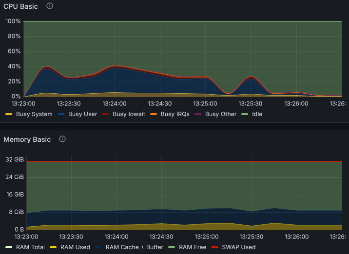
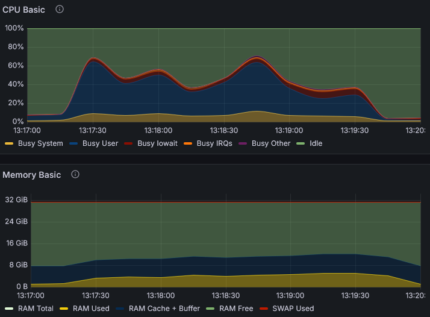

# Performance

## PreStarting Comparison
_As of: 2024-05-03_

> [!NOTE]
> PreStarting performance is highly situational. 
> Checkout the JavaDocs for more information.

### Initial situation

* Running the demo webapp integration tests
* Parallelization (tests executed in parallel) is 2
* Launched using the launch files in the demo

#### Environment
* Windows + Docker Desktop
* Ryzen 3700X 8C/16T @3.6GHz
* 32GB available RAM for Docker

### Results

| | Without PreStarting | With PreStarting |
| --- | --- | --- |
| Total duration | 3m 22s | 2m 34s | 
| Average duration per test | 25s | 20s |
| PreStarting Utilization (how often was PreStarted infrastructure used instead of directly booting it) | - | >90% |
| Avg. time to get basic infra (db, oidc, app) | 10s | 9s |
| Avg. time to get Selenium/WebDriver | 7s | 1s |
| Resource utilization |  |  |
