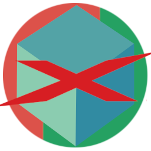

#  Testcontainers Infrastructure (TCI) Framework Base

Basis Module for XDEV's Testcontainer Infrastructure Framework

## Features
* Easily create infrastructure using - TCI (TestContainer Infrastructure) templating + Factories for that
  * [PreStarting mechanism](./tci-base/src/main/java/software/xdev/tci/factory/prestart/) for [additional performance](./PERFORMANCE.md)
* An optimized [implementation of Network](./tci-base/src/main/java/software/xdev/tci/network/)
* [Safe starting of named containers](./tci-base/src/main/java/software/xdev/tci/safestart/)
* [Container Leak detection](./tci-base/src/main/java/software/xdev/tci/leakdetection/)
* [Tracing](./tci-base/src/main/java/software/xdev/tci/tracing/)

## Usage
This module has many different components that can be used in different situations in different ways.

Detailed documentation is also available in the JavaDocs.

Checkout the [advanced demo](./tci-advanced-demo/) as a reference to get a feeling how this can be done.

## Installation
[Installation guide for the latest release](https://github.com/xdev-software/tci-base/releases/latest#Installation)

## Support
If you need support as soon as possible and you can't wait for any pull request, feel free to use [our support](https://xdev.software/en/services/support).

## Contributing
See the [contributing guide](./CONTRIBUTING.md) for detailed instructions on how to get started with our project.

## Dependencies and Licenses
View the [license of the current project](LICENSE) or the [summary including all dependencies](https://xdev-software.github.io/tci-base/dependencies)
