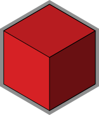

 

#  Testcontainers Infrastructure (TCI) Framework

Modules for XDEV's Testcontainer Infrastructure Framework

## Modules

* [base](./base/)
  * Common code for writing TCI
  * Pre-starting
  * Container leak detection
  * and much more
* [bom](./bom/)
  * Bill of Materials for easier version management
* [db-jdbc](./db-jdbc/)
  * Common code for db infra, including JDBC
  * Data-generation template
  * Improved JDBC Container wait strategy
  * Predefined implementations for [Spring-ORM](./db-jdbc-spring-orm/), [Hibernate](./db-jdbc-spring-orm-hibernate/) and [EclipseLink](./db-jdbc-spring-orm-eclipselink/)
* [image-build](./image-build/)
  * Contains some shortcuts that help with common build configuration e.g. related to caching
  * Designed to work together with the [`docker-image-cache` actions](./.github/actions/docker-image-cache/)
* [jacoco](./jacoco/)
  * Allows for recording of JaCoCo code coverage files with Java containers
* [jul-to-slf4j](./jul-to-slf4j/)
  * Logging Adapter to redirect JUL to SLF4J
* [junit-jupiter-api-support](./junit-jupiter-api-support/)
  * Support for JUnit 5+ (Jupiter) API
* [mailpit](./mailpit/)
  * Predefined implementation for [Mailpit](https://github.com/axllent/mailpit)
* [mockserver](./mockserver/)
  * Predefined implementation for [Mockserver](https://github.com/xdev-software/mockserver-neolight)
* [oidc-server-mock](./oidc-server-mock/)
  * Predefined implementation for [OIDC Server Mock](https://github.com/xdev-software/oidc-server-mock)
* [selenium](./selenium/)
  * Predefined implementation for [Selenium](https://github.com/SeleniumHQ/selenium)
  * Includes improvements from [xdev-software/testcontainers-selenium](https://github.com/xdev-software/testcontainers-selenium/)
  * Predefined browsers (Firefox, Chromium)
  * NoVNC support (you no longer need a VNC client and can simply use the browser)
  * Enhanced video recording
  * Browser logs
* [spring-dao-support](./spring-dao-support/)
  * Helper for injecting DAOs using Spring

## Usage

You may checkout the [advanced demo](./advanced-demo/) - a reference implementation of most features in a realistic project - to get a better feeling how the project can be used.

You can also have a look at the corresponding modules for usage instructions.

> [!TIP]
> More detailed documentation is usually available in the corresponding [JavaDocs](https://javadoc.io/doc/software.xdev.tci).

## Installation
[Installation guide for the latest release](https://github.com/xdev-software/tci/releases/latest#Installation)

## Support
If you need support as soon as possible and you can't wait for any pull request, feel free to use [our support](https://xdev.software/en/services-products/support).

## Contributing
See the [contributing guide](./CONTRIBUTING.md) for detailed instructions on how to get started with our project.

## Dependencies and Licenses
View the [license of the current project](LICENSE) or the [summary including all dependencies](https://xdev-software.github.io/tci)
